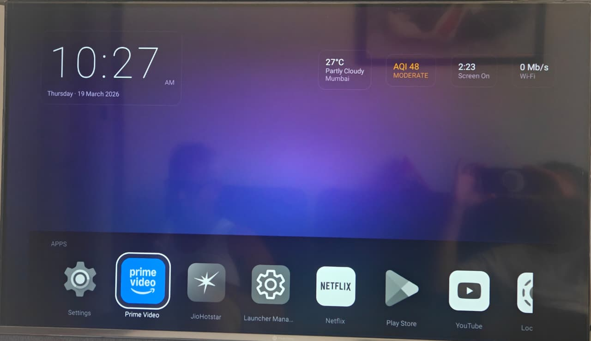

<div align="center">

# ✦ YUKUZA LAUNCHER

### A cinematic Android TV launcher built with Jetpack Compose

[](https://developer.android.com/tv)
[](https://kotlinlang.org)
[](https://developer.android.com/jetpack/compose)
[](https://developer.android.com/about/versions/lollipop)
[](LICENSE)

*Where your living room screen becomes a window to everything.*

</div>

---

## ✦ What is Yukuza?

Yukuza is a next-generation Android TV launcher that trades the boring grid for a **living, breathing interface**. Five GPU-composited aurora blobs drift across a deep-space canvas. App icons hibernate in monochrome and spring to full colour the moment you focus them. The weather, air quality, network speed, and your music — all visible at a glance from a single screen.

No clutter. No compromises. Just TV, done right.

---

## ✦ Features

### 🌌 Aurora Background
A custom `Canvas` composable drives five independently animated blobs using `graphicsLayer` and GPU compositing. The result is a continuously shifting aurora that never repeats — no video file, pure code.

### 🎯 Smart App Strip
- Apps sort automatically by **launch frequency** — the more you use an app, the closer to the front it lives
- **TV Settings** is always pinned at position one
- Icons are **monochrome at rest**, spring to full colour on D-pad focus with a smooth `FastOutSlowInEasing` tween
- A white focus ring fades in around the selected tile — no black bars, no clipping artifacts

### 🌤 Live Weather & AQI
- Pulls real-time temperature and weather condition from **Open-Meteo**
- Air quality index from **air-quality-api.open-meteo.com** (separate domain — correctly wired)
- Tap the temperature widget to **search and pin any city** via the Open-Meteo geocoding API
- Chosen city persists across reboots via **DataStore**

### 🎵 Now Playing Widget
- Spinning album art disc, animated progress bar, track and artist name
- Animates in from centre when media is active, hides when nothing is playing
- Powered by a `NotificationListenerService` — works with any music app

### ⚡ Top Bar Widgets
| Widget | Data |
|---|---|
| 🕐 Clock | Live time, large Roboto display font |
| 🌡 Weather | Temp + condition + city name |
| 🌿 AQI | European AQI with colour-coded category |
| ⏱ Screen Timer | Elapsed session time |
| 📶 Network | Real-time download/upload speed |

### ⚙️ Quick Settings Overlay
Swipe up from the gear icon for instant access to:
- Volume slider (Media stream)
- Brightness slider (when `WRITE_SETTINGS` is granted)
- Night Mode toggle
- Bluetooth toggle
- Game Mode & Input Source (HDMI-CEC devices)

### 🏙 City Picker
Tap the temperature widget → type a city name → results appear instantly from the geocoding API with country and region subtitles. D-pad-navigable list with a clear white focus ring on each row.

---



## ✦ How to Install

Most Android TV devices don't offer a built-in launcher picker. Follow these steps:

**Step 1 — Transfer APKs to your TV using [LocalSend](https://localsend.org)**

LocalSend is a free, open-source app that lets you wirelessly send files between devices on the same Wi-Fi network — no cables, no account required.

1. Install **LocalSend** on both your phone/PC and your Android TV
2. Download both APKs from the [releases page](https://github.com/urunkarpm/yukuza-launcher/releases/tag/v1.0.0):
   - `yukuza-launcher-v1.0.0.apk`
   - `Launch Manager - Android TV_1.0.3_APKPure.apk`
3. Open LocalSend on your phone/PC, select both APK files, and send them to your TV
4. Accept the transfer on your TV — files will be saved to local storage

**Step 2 — Install Launch Manager first**

Open a file manager on your TV, navigate to the downloaded `Launch Manager - Android TV_1.0.3_APKPure.apk` and install it.

**Step 3 — Install Yukuza Launcher**

In the same file manager, install `yukuza-launcher-v1.0.0.apk`.

**Step 4 — Set as default**

Open **Launch Manager** on your TV and select **Yukuza Launcher** as the default home app.

> **Alternative (stock Android TV):** Settings → Device Preferences → Home screen → Home app → Yukuza Launcher *(only available on some devices)*

---

## ✦ Architecture

```
app/
├── data/
│   ├── db/          Room — app order, launch counts, colour cache, weather cache
│   ├── entity/      AppOrderEntity, AppLaunchCountEntity, WeatherCacheEntity, …
│   ├── remote/      OpenMeteoApi, AirQualityApi, GeocodingApi (Retrofit + Moshi)
│   ├── repository/  AppRepository, WeatherRepository
│   └── worker/      WeatherSyncWorker, PalettePreWarmWorker
├── di/              Hilt modules — Database, Network, App
├── domain/
│   ├── model/       AppInfo, WeatherData, AqiData, MediaData, NetworkData
│   └── usecase/     GetApps, GetWeather, GetAqi, GetNetwork, GetMedia, IncrementLaunchCount, …
├── navigation/      LauncherNavGraph
└── ui/
    ├── components/
    │   ├── AppIcon.kt        Focus animation — mono→colour, scale, ring
    │   ├── AppRow.kt         LazyRow with D-pad navigation
    │   ├── aurora/           AuroraBackground Canvas composable
    │   ├── glass/            GlassCard — blur background layer + unblurred content
    │   └── widgets/          Clock, Weather, AQI, ScreenTimer, Network, NowPlaying
    ├── overlay/
    │   ├── CityPickerPopup.kt
    │   └── QuickSettingsOverlay.kt
    └── screen/
        ├── home/             HomeScreen + HomeViewModel + HomeUiState
        └── apps/             AppListScreen
```

**Stack:** Kotlin 2.0 · Jetpack Compose · Hilt · Room · DataStore · WorkManager · Retrofit · Moshi · Coil · Palette · Kotlinx Immutable Collections · Baseline Profiles

---

## ✦ Getting Started

### Prerequisites
- Android Studio Ladybug or newer
- Android TV device or emulator (API 21+)
- ADB enabled on your TV

### Build & Install

```bash
# Clone
git clone https://github.com/your-username/yukuza-launcher.git
cd yukuza-launcher

# Debug build
./gradlew assembleDebug
adb install -r app/build/outputs/apk/debug/app-debug.apk

# Release build (requires keystore — see below)
./gradlew assembleRelease
adb install -r app/build/outputs/apk/release/app-release.apk
```

### Release Signing

Create `keystore.properties` in the project root (already gitignored):

```properties
storeFile=../your-keystore.jks
storePassword=your_store_password
keyAlias=your_alias
keyPassword=your_key_password
```

Generate a new keystore if needed:
```bash
keytool -genkey -v -keystore your-keystore.jks -alias your_alias \
  -keyalg RSA -keysize 2048 -validity 10000
```

---

## ✦ Permissions

| Permission | Purpose |
|---|---|
| `INTERNET` | Weather, AQI, geocoding API calls |
| `ACCESS_COARSE_LOCATION` | Optional location fallback |
| `BIND_NOTIFICATION_LISTENER_SERVICE` | Now Playing detection |
| `WRITE_SETTINGS` | Brightness slider |
| `PACKAGE_USAGE_STATS` | Screen time widget |
| `RECEIVE_BOOT_COMPLETED` | Restart background sync after reboot |

---

## ✦ API Credits

- **Weather & AQI** — [Open-Meteo](https://open-meteo.com/) — free, no API key required
- **Geocoding** — [Open-Meteo Geocoding](https://open-meteo.com/en/docs/geocoding-api) — free, no API key required

---

## ✦ Contributing

Pull requests are welcome. For major changes please open an issue first.

1. Fork the repo
2. Create a feature branch: `git checkout -b feat/your-feature`
3. Commit: `git commit -m "feat: your feature"`
4. Push: `git push origin feat/your-feature`
5. Open a Pull Request

---

## ✦ License

```
MIT License — Copyright (c) 2025 Yukuza
```

<div align="center">

*Built with obsession for the 10-foot experience.*

</div>
